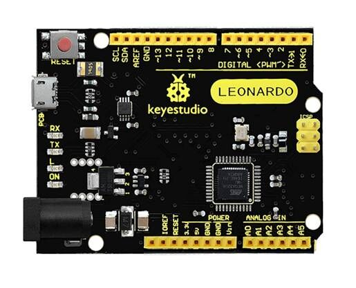
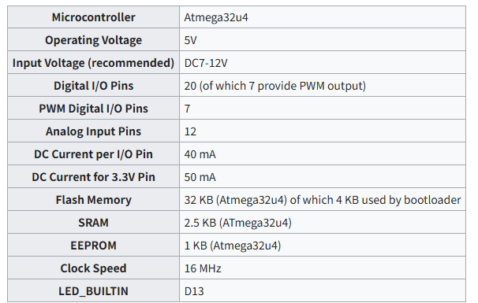
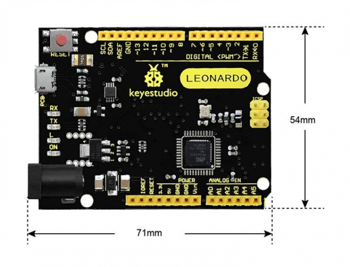
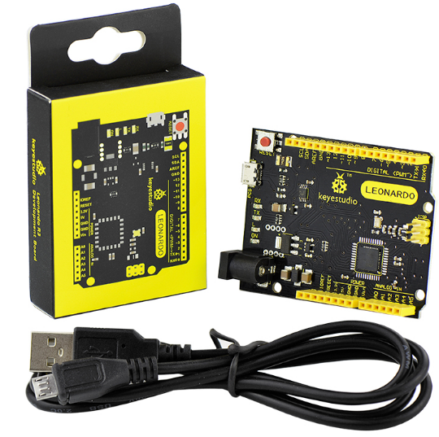

# Ks0248 keyestudio Leonardo R3 Development Board

## Introduction

The keyestudio Leonardo is a microcontroller board based on the ATmega32u4 . It is an easy-to-use open source hardware.
 It has 20 digital input/output pins (of which 7 can be used as PWM  outputs), 12 analog inputs, a 16 MHz crystal oscillator, a micro USB  connection, a power jack, an ICSP header, and a reset button. 
 It contains everything needed to support the microcontroller; simply  connect it to a computer with a USB cable or power it with a AC-to-DC  adapter or battery to get started.  Note that ICSP (In-Circuit Serial Programming) header can not only  program the firmware to Atmega32u4, but also be used as SPI  communication interface. 
 The keyestudio Leonardo can be powered via the micro USB connection, or  via an external power supply jack (DC 7-12V) or even with female headers Vin /GND (DC 7-12V).
 The Leonardo differs from other Arduino boards using separate USB-Serial chip in that the ATmega32u4 has built-in USB communication, eliminating the need for a secondary processor. This allows the Leonardo to appear  to a connected computer as a mouse and keyboard.

## TECH SPECS

## Details

- **PCB Dimensions:** 71mm/54mm/15mm

- **Weight:** 18.4g

  

## Element and Interfaces

Here is an explanation of what every element and interface of the board does:

## Specialized Functions of Some Pins

| **Digital I/O pins**             | D0-D13 and A0-A5 (D18-D23); Note that if the digital pins are not enough, the ICSP pins can be used as digital pins. MISO (D14); SCK(D15); MOSI (D16). |
| -------------------------------- | ------------------------------------------------------------ |
| **Analog Inputs**                | A0-A5, A6-A11 (on digital pins 4, 6, 8, 9, 10, and 12). That is, D4 (A6)、D6 (A7)、D8 (A8)、D9 (A9)、D10 (A10) and D12 (A11).Pins A0-A5 appear in the same locations as on the Uno; inputs A6-A11 are on digital i/o pins 4, 6, 8, 9, 10, and 12 respectively. Each analog input provide 10 bits of resolution (i.e. 1024 different values). By default the analog inputs measure from ground to 5 volts, though is it possible to change the upper end of their range using the AREF pin and the [analogReference()](https://www.arduino.cc/en/Reference/AnalogReference) function. |
| **PWM (Pulse-Width Modulation)** | D3, D5, D6, D9, D10, D11 and D13. Provide 8-bit PWM output with the [analogWrite()](https://www.arduino.cc/en/Reference/AnalogWrite) function. |
| **External Interrupts**          | D3 (interrupt 0); D2 (interrupt 1); D0 (interrupt 2), D1 (interrupt 3) and D7 (interrupt 4).These pins can be configured to trigger an interrupt on a low value, a rising or falling edge, or a change in value. See the [attachInterrupt()](https://www.arduino.cc/reference/en/language/functions/external-interrupts/attachinterrupt/) function for details. |
| **Serial communication**         | D0 (RX) and D1 (TX).                                         |
| **SPI communication**            | On the ICSP header.These pins support SPI communication using the [SPI library](https://www.arduino.cc/en/Reference/SPI). Note: the SPI pins are not connected to any of the digital I/O pins as they are on the Uno. They are only available on the ICSP connector. This means that if you have a shield that uses SPI, but does NOT have a 6-pin ICSP connector that connects to the Leonardo's 6-pin ICSP header, the shield will not work. |
| **AREF**                         | Reference voltage for the analog inputs.Used with [analogReference()](https://www.arduino.cc/en/Reference/AnalogReference). Sometimes used to set the external reference voltage (0-5 volts) as the upper end of analog input pins. |
| **IOREF**                        | The voltage at which the i/o pins of the board are operating (i.e. VCC for the board).This is 5V on the Leonardo. Used to configure the operating voltage of microcontroller. |

## Tips

- **Automatic (Software) Reset:**

Rather then requiring a physical press of the reset button before an upload, the Arduino Nano is designed in a way that allows it to be reset by software running on a connected computer.

- **USB Overcurrent Protection:**

The Leonardo has a resettable polyfuse that protects your computer's USB ports from shorts and overcurrent. Although most computers provide their own internal protection, the fuse provides an extra layer of protection. If more than 500 mA is applied to the USB port, the fuse will automatically break the connection until the short or overload is removed.

## Package Included

- keyestudio Leonardo R3 board * 1pcs
- Black micro USB cable 1m * 1pcs
  