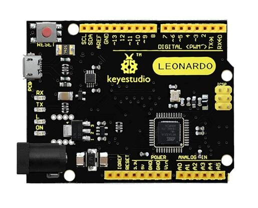
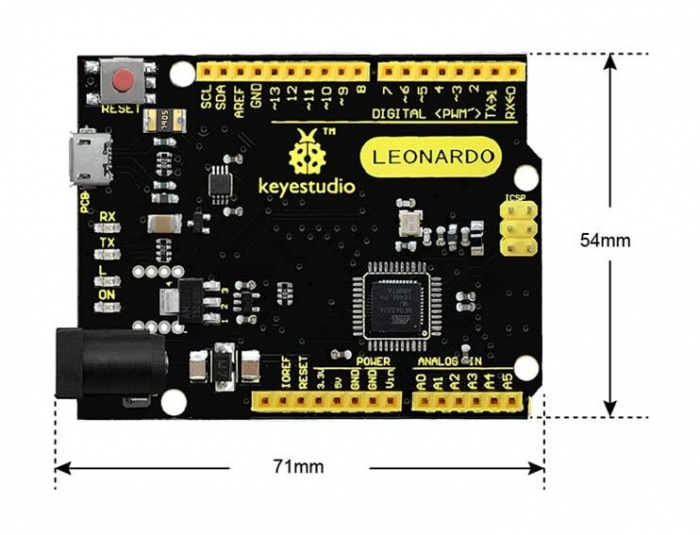
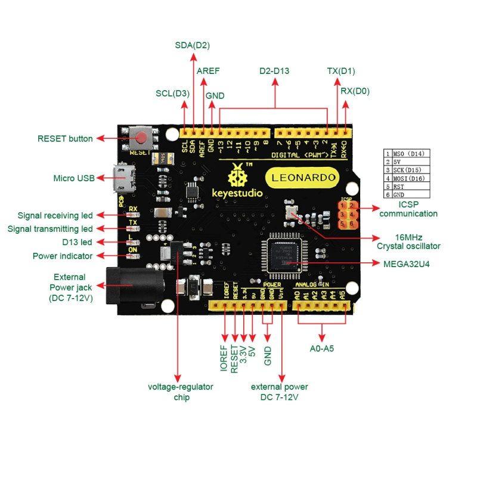
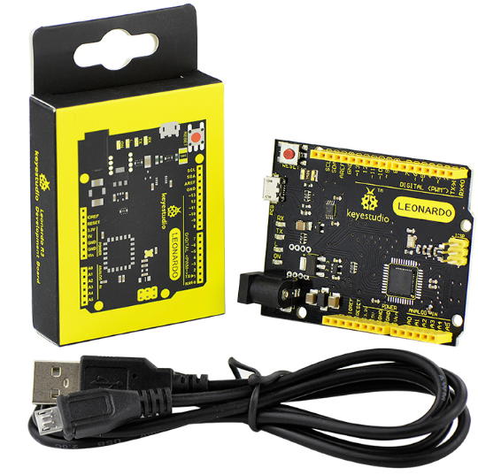

# Ks0248 keyestudio Leonardo R3 Development Board



## Introduction

The keyestudio Leonardo is a microcontroller board based on the ATmega32u4 . It is an easy-to-use open source hardware.
 It has 20 digital input/output pins (of which 7 can be used as PWM  outputs), 12 analog inputs, a 16 MHz crystal oscillator, a micro USB  connection, a power jack, an ICSP header, and a reset button. 
 It contains everything needed to support the microcontroller; simply  connect it to a computer with a USB cable or power it with a AC-to-DC  adapter or battery to get started.  Note that ICSP (In-Circuit Serial Programming) header can not only  program the firmware to Atmega32u4, but also be used as SPI  communication interface. 
 The keyestudio Leonardo can be powered via the micro USB connection, or  via an external power supply jack (DC 7-12V) or even with female headers Vin /GND (DC 7-12V).
 The Leonardo differs from other Arduino boards using separate USB-Serial chip in that the ATmega32u4 has built-in USB communication, eliminating the need for a secondary processor. This allows the Leonardo to appear  to a connected computer as a mouse and keyboard.

## Specifications

| Microcontroller             | Atmega32u4                                          |
| --------------------------- | --------------------------------------------------- |
| Operating Voltage           | 5V                                                  |
| Input Voltage (recommended) | DC7-12V                                             |
| Digital I/O Pins            | 20 (of which 7 provide PWM output)                  |
| PWM Digital I/O Pins        | 7                                                   |
| Analog Input Pins           | 12                                                  |
| DC Current per I/O Pin      | 40 mA                                               |
| DC Current for 3.3V Pin     | 50 mA                                               |
| Flash Memory                | 32 KB (Atmega32u4) of which 4 KB used by bootloader |
| SRAM                        | 2.5 KB (ATmega32u4)                                 |
| EEPROM                      | 1 KB (Atmega32u4)                                   |
| Clock Speed                 | 16 MHz                                              |
| LED_BUILTIN                 | D13                                                 |

## Details

- **PCB Dimensions:** 71mm-54mm-15mm

- **Weight:** 18.4g

  

## Element and Interfaces

Here is an explanation of what every element and interface of the board does:



## Specialized Functions of Some Pins

| Pin Function                     | Technical Description and Mapping                            |
| :------------------------------- | :----------------------------------------------------------- |
| **Digital I/O Pins**             | **D0 – D13** and **A0 – A5** (which map to **D18 – D23**). <br>• **Note:** If more digital pins are required, the ICSP header pins can be used as **D14 (MISO)**, **D15 (SCK)**, and **D16 (MOSI)**. |
| **Analog Inputs**                | **A0 – A11** (12 channels total). <br>• **Standard:** A0 – A5 are in the same location as the Uno.<br>• **Extended:** A6 – A11 are mapped to digital pins **D4, D6, D8, D9, D10, and D12** respectively.<br>• **Spec:** 10-bit resolution (1024 values). Range is 0–5V by default, adjustable via the **AREF** pin and `analogReference()`. |
| **PWM (Pulse-Width Modulation)** | **D3, D5, D6, D9, D10, D11, and D13.** <br>• Provides 8-bit PWM output using the `analogWrite()` function. |
| **External Interrupts**          | **D3 (Int 0), D2 (Int 1), D0 (Int 2), D1 (Int 3), and D7 (Int 4).** <br>• These pins can trigger interrupts on low value, rising/falling edge, or value change. See `attachInterrupt()` for implementation. |
| **Serial Communication**         | **D0 (RX) and D1 (TX).** <br>• **Note:** On the Leonardo, the `Serial` class refers to USB (CDC) communication. For pins 0 and 1, you must use the **`Serial1`** class. |
| **I2C / TWI Communication**      | **D2 (SDA) and D3 (SCL).** <br>• Supports TWI communication using the **Wire library**. |
| **SPI Communication**            | **ICSP Header only.** <br>• Supports SPI using the **SPI library**. <br>• **Critical Note:** Unlike the Uno, SPI pins are **not** connected to D11, D12, or D13. Shields without a 6-pin ICSP connector will not support SPI on this board. |
| **AREF**                         | Reference voltage for analog inputs. Used with `analogReference()`. |
| **IOREF**                        | Provides the operating voltage reference (5V) for the microcontroller, allowing shields to adapt to the board's voltage. |

## Test code

```cpp
void setup() {
  pinMode(13, OUTPUT);
  Serial.begin(9600);

  while (!Serial) {
    digitalWrite(13, HIGH);
    delay(100);
    digitalWrite(13, LOW);
    delay(100);
  }

  Serial.println("========================================");
  Serial.println("Keyestudio Leonardo R3 Test Program");
  Serial.println("Status: USB Serial Connection - OK");
  Serial.println("========================================");
}

void loop() {
  unsigned long uptimeSeconds = millis() / 1000;

  Serial.print("[SUCCESS] Leonardo R3 is running normally. Uptime: ");
  Serial.print(uptimeSeconds);
  Serial.println(" seconds.");

  digitalWrite(13, HIGH);
  delay(500);
  digitalWrite(13, LOW);
  delay(500);
}
```

## Test results

After uploading the code, open the serial monitor and set the baud rate to 9600. You will see the serial monitor print the prompt message. Additionally, the flashing frequency of the on-board LED differs when the serial monitor is turned on and off.

## Tips

- **Automatic (Software) Reset:**

Rather then requiring a physical press of the reset button before an upload, the Arduino Nano is designed in a way that allows it to be reset by software running on a connected computer.

- **USB Overcurrent Protection:**

The Leonardo has a resettable polyfuse that protects your computer's USB ports from shorts and overcurrent. Although most computers provide their own internal protection, the fuse provides an extra layer of protection. If more than 500 mA is applied to the USB port, the fuse will automatically break the connection until the short or overload is removed.

## Package Included

- keyestudio Leonardo R3 board * 1pcs
- Black micro USB cable 1m * 1pcs
  